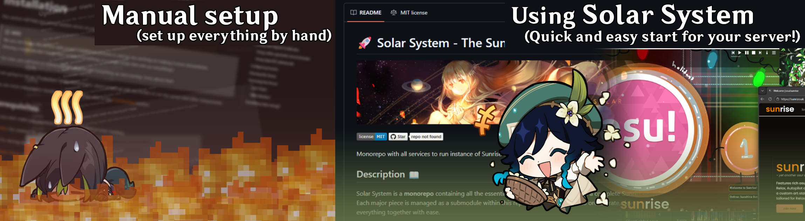

# 🌅 Sunrise - osu! private server

<p align="center">
  
</p>

[](https://opensource.org/licenses/MIT)
[](https://github.com/SunriseCommunity/Sunrise)

Sunrise is a private server for osu! written in C#. This repository has both endpoints for game-client and for the
website. The server is currently in development and is not yet ready for public use.

> [!NOTE]
> Want to help? Have a question? :shipit: Feel free then to join our [Discord server](https://discord.gg/BjV7c9VRfn), there you can ask any question to maintainers of this project!

<!-- TODO: Uncomment after I will be done with Solar System

## 📦 How to Set Up

If you are planning to host your own instance of Sunrise, please highly consider using the **[Solar System monorepo](https://github.com/SunriseCommunity/Solar-System)**.



It includes Sunrise and other all required services for a fully functional Sunrise server. As a bonus, it also includes **a website** and **a Discord bot**! **This is the recommended way to set up your Sunrise server without the need to manually set up each service.**

If you are looking for the official documentation, please refer to [docs.sunrize.uk](https://docs.sunrize.uk).
-->

------

> [!IMPORTANT]
> **READ ME IF YOU ARE SELF-HOSTING SUNRISE AND SET UP IT BEFORE THE MOVE TO SOLAR SYSTEM MONOREPO**
>
> Due to move to the Solar System monorepo we made almost non-compatible changes to the Sunrise. If you were using Sunrise before, please watch out for the following breaking changes:
> - **We now use `.env` file for environment variables instead of `appsettings.json`** - Please refer to step 3.1 of the _Standalone installation with self-signed certificate (Docker) 🐳_ or _Development installation ⚒️_ sections for more information.
>- **⚠️ Hangfire now uses MySQL instead of Postgres** - This change is most important and requires action if you try to update your existing Sunrise server.
> - - If you see `Deprecated hangfire connection was using Postgres, which is no longer supported` error at the server startup, please create `.env` file and setup the `HANGFIRE_*` variables according to your MySQL setup. View example below:
> ```bash
>   # Check your MySQL connection details from `appsettings.*.json` file:
>       "ConnectionString": "Host=mysql-sunrise-db;Port=3306;Database=sunrise;Username=root;Password=root;SslMode=Required;"
>   # Then set the following variables in your `.env` file:
>   HANGFIRE_HOST=mysql-sunrise-db
>   HANGFIRE_PORT=3306
>   HANGFIRE_USER=root
>   HANGFIRE_PASSWORD=root
>   ```
> - **We dropped docker compose setup for prometheus and grafana** - These services were an overhead for the solo Sunrise server setup. They are now included in the Solar System monorepo only.


## Features 🌟

### Core features

- [x] Login and registration system
- [x] Score submission and leaderboards
- [x] Chat implementation
- [x] Chat Bot (as a replacement for Bancho Bot)
- [x] Multiplayer
- [x] !mp commands (mostly)
- [x] Server website (located at [Sunset](https://github.com/SunriseCommunity/Sunset))
- [x] Support for non-standard gamemodes (e.g. Relax, Autopilot, ScoreV2)
- [x] Custom beatmap status system
- [x] osu!Direct
- [x] Spectating
- [x] Beatmap hype system
- [x] Achievements (Medals)
- [x] Rank snapshots
- [x] Ability to upload custom server backgrounds

### Additional features

- [x] Automated tests (unit and integration)
- [x] Telemetry system with Prometheus, Loki and Tempo
- [x] Rate limiter for both internal and external requests
- [x] Redis caching for faster response times
- [x] Docker support
- [x] Database migrations
- [x] Database backups

> [!IMPORTANT]
> The list of features is in priority order. The higher the feature is, the more important it is.

## Standalone installation with self-signed certificate (Docker) 🐳

1. Clone the repository
2. Open the project's folder in any CLI environment.
3. Set up production environment
   - Create the file `Sunrise.Server/appsettings.Production.json` and fill it following the `Sunrise.Server/appsettings.Production.json.example` example.

     ```bash
     cp Sunrise.Server/appsettings.Production.json.example Sunrise.Server/appsettings.Production.json
     ```

   - Set the environment variables in the `.env` file.

     ```bash
     cp .env.example .env
     ```

> [!WARNING]
> Make sure to update `WEB_DOMAIN` and `API_TOKEN_SECRET` values!

4. Set up the beatmap manager by following the instructions in
   the [Observatory repository](https://github.com/SunriseCommunity/Observatory). After setting up the beatmap manager,
   you need to set the `General:ObservatoryUrl` in the `Sunrise.Server/appsettings.Production.json` file to the address of the beatmap manager.
   - **NB:** Make sure that the PORT is defined properly (sunrise checks port 3333 by default) and POSTGRES_PORT value doesn't conflict with other PC ports.
5. ⚠️ **Please create `sunrise.pfx` file and move it to `Sunrise/sunrise.pfx` folder, for more instructions follow** [Local connection ⚙️](##local-connection).
6. Start server by running:
   ```bash
   docker compose -f docker-compose.yml up -d
   ```
7. (Optional) If you want to connect to the server locally, please refer to
   the [Local connection ⚙️](##local-connection)
   section.

> [!TIP]
> Your final docker setup should look like this:
>
> 

## Development installation ⚒️

1. Clone the repository
2. Open the project's folder in any CLI environment.
3. Set up development environment by running:
   ```bash
   docker compose -f docker-compose.dev.yml up -d
   ```
4. Set up the beatmap manager by following the instructions in
   the [Observatory repository](https://github.com/SunriseCommunity/Observatory). After setting up the beatmap manager,
   you need to set the `General:ObservatoryUrl` in the `Sunrise.Server/appsettings.{Your Environment}.json` file to the address of the beatmap manager.
   - **NB:** Make sure that the PORT is defined properly (sunrise checks port 3333 by default) and POSTGRES_PORT value doesn't conflict with other PC ports.
5. ⚠️ **Please create `sunrise.pfx` file and move it to `Sunrise/sunrise.pfx` folder, for more instructions follow** [Local connection ⚙️](##local-connection).
6. Run the project
7. (Optional) If you want to connect to the server locally, please refer to
   the [Local connection ⚙️](##local-connection)
   section.

### Local connection ⚙️

#### If you want to connect to the server locally, follow these steps:

1. Add a launch argument `-devserver sunrise.local` to your osu! shortcut.
2. Open the `hosts` file located in `C:\Windows\System32\drivers\etc\hosts` (C:\ is your system drive) with a text
   editor and add the following line:

   ```hosts
   ... (rest of the file)

   # Sunrise Web Section
   127.0.0.1 sunrise.local
   127.0.0.1 api.sunrise.local
   # Sunrise osu! Section
   127.0.0.1 osu.sunrise.local
   127.0.0.1 a.sunrise.local
   127.0.0.1 c.sunrise.local
   127.0.0.1 assets.sunrise.local
   127.0.0.1 cho.sunrise.local
   127.0.0.1 assets.sunrise.local
   127.0.0.1 c4.sunrise.local
   127.0.0.1 b.sunrise.local
   ```

> [!WARNING]
> Don't forget to save the file after editing.

3. Generate a self-signed certificate for the domain `sunrise.local` by running the following commands in the terminal:

   ```bash
   openssl req -x509 -newkey rsa:4096 -sha256 -days 3650 -nodes -keyout sunrise.local.key -out sunrise.local.crt -subj "/CN=sunrise.local" -addext "subjectAltName=DNS:sunrise.local,DNS:*.sunrise.local,IP:10.0.0.1"
   ```

4. Convert the certificate to the PKCS12 format (for ASP.Net) by running the following command in the terminal:

   ```bash
   openssl pkcs12 -export -out sunrise.pfx -inkey sunrise.local.key -in sunrise.local.crt -password pass:password
   ```

5. Import the certificate to the Trusted Root Certification Authorities store by running the following command in the
   terminal:

   ```bash
   certutil -addstore -f "ROOT" sunrise.local.crt
   ```

6. Move the generated `sunrise.pfx` file to the `Sunrise` directory.

7. Run the server and navigate to `https://api.sunrise.local/docs` to check if the server is running.

## Dependencies 📦

- [Observatory (beatmap manager)](https://github.com/SunriseCommunity/Observatory)

## Contributing 💖

If you want to contribute to the project, feel free to fork the repository and submit a pull request. We are open to any
suggestions and improvements.
